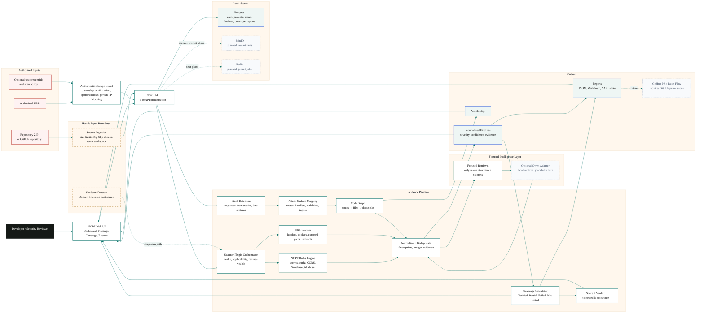

# NOPE

Your app works. That does not mean it is secure.

NOPE is a local-first, evidence-driven application security orchestration platform. Security scanners find evidence, the pipeline organizes it, the code graph connects it, RAG retrieves only what matters, Qwen can reason over focused context, tests verify the result, and rescanning checks the fix.

## Current status

NOPE is a working local MVP, not a finished production platform. The current build includes:

- A redesigned public graphite landing page at `/`.
- Transparent landing navigation with a login-gated `Open dashboard` flow.
- A routed dark app workspace under `/app/projects/local`.
- A React Bits LineSidebar-style dashboard navigation shell.
- Local Postgres-backed account creation, login, sessions, and logout.
- Migration-backed Postgres persistence for projects, scans, stages, scanner runs, findings, evidence, coverage, and generated report payloads.
- FastAPI orchestration API.
- Next.js dashboard.
- ZIP repository ingestion with Zip Slip protections.
- Authorized URL scan path with scope checks.
- Stack detection.
- Attack-surface mapping.
- Lightweight code graph.
- NOPE deterministic rule pack.
- Scanner plugin contracts for Semgrep, Gitleaks, OSV-Scanner, Trivy, Checkov, Hadolint, Bandit, and ecosystem audit adapters.
- Finding normalization, deduplication, scoring, verdicts, coverage tracking, and reports.
- Optional Qwen/local-AI configuration through llama.cpp with graceful failure.
- Docker Compose stack with web, API, worker, Postgres, Redis, and MinIO.

External scanner CLIs and a local Qwen runtime are intentionally not faked. If they are unavailable, NOPE marks that coverage as failed, skipped, or not tested.

## Pipeline DFD



## Local endpoints

- Web UI: `http://localhost:3000`
- Login: `http://localhost:3000/login`
- Dashboard: `http://localhost:3000/app/projects/local`
- API: `http://localhost:8000`
- API docs: `http://localhost:8000/docs`
- MinIO UI: `http://localhost:9001`

## Local login

The `Open dashboard` action goes to `/login`. The first successful login with an email and an 8+ character password creates a local account in Postgres. Later logins use the same credentials, issue an HttpOnly `nope_session` cookie, and unlock a fresh dashboard workspace.

For Docker, the web container uses `API_URL_INTERNAL=http://nope-api:8000` for server-side auth calls and `NEXT_PUBLIC_API_URL=http://localhost:8000` for browser-facing report links.

## Run

```bash
docker compose up --build -d
```

```bash
docker compose down
```

AI CPU mode:

```bash
docker compose -f docker-compose.yml -f docker-compose.ai-cpu.yml --profile ai-cpu up --build -d
```

AI GPU mode:

```bash
docker compose -f docker-compose.yml -f docker-compose.ai-gpu.yml --profile ai-gpu up --build -d
```

Set `NOPE_MODEL_DIR` and `NOPE_QWEN_MODEL_FILE` before starting AI mode. The current local model path is `D:\Desktop\Model\Qwen3-8B-Q4_K_M.gguf`. See `docs/LOCAL_AI.md`.

## Local development

API:

```bash
cd apps/api
python -m pip install -r requirements-dev.txt
python -m pytest
python -m uvicorn nope_api.main:app --reload --port 8000
```

Web:

```bash
pnpm install
pnpm --dir apps/web dev
pnpm --dir apps/web lint
pnpm --dir apps/web typecheck
pnpm --dir apps/web build
```

## Scan modes

URL-only:

- Requires explicit authorization confirmation.
- Blocks private-network and localhost targets by default.
- Checks security headers, cookies, exposed paths, CORS, and redirects.
- Clearly reports that source code was not inspected.

Repository-only:

- Accepts ZIP uploads.
- Extracts into a temporary workspace with size, file-count, symlink, and path traversal protections.
- Runs stack detection, attack-surface mapping, code graph construction, NOPE rules, scanner adapters, deduplication, coverage, and reports.
- Clearly reports when runtime behavior was not verified.

Full scan:

- Combines repository and URL checks.
- Provides the contract for sandbox, dynamic testing, focused retrieval, and optional AI review.
- Deep sandbox execution and ZAP-style crawling are still partial and tracked in `docs/FEATURE_STATUS.md`.

## API highlights

- `GET /health`
- `POST /api/auth/login`
- `GET /api/auth/me`
- `POST /api/auth/logout`
- `POST /api/scans/url`
- `POST /api/scans/repository`
- `POST /api/scans/full`
- `GET /api/scans`
- `GET /api/scans/{scan_id}`
- `GET /api/scans/{scan_id}/findings`
- `GET /api/scans/{scan_id}/coverage`
- `GET /api/scans/{scan_id}/attack-map`
- `GET /api/scans/{scan_id}/report.json`
- `GET /api/scans/{scan_id}/report.md`
- `GET /api/scans/{scan_id}/report.sarif`
- `GET /api/settings/model`
- `POST /api/settings/model/test`

Except for health and login, API routes require a valid `Authorization: Bearer <nope_session>` token. Dashboard server routes forward the HttpOnly local session cookie automatically.

See `docs/API_REFERENCE.md` for more detail.

## Verification snapshot

Last verified locally:

- `$env:PYTHONPATH='apps/api'; python -m pytest apps/api/tests`: passed, 16 tests.
- `python -m compileall nope_api tests`: passed.
- `pnpm --dir apps/web lint`: passed.
- `pnpm --dir apps/web typecheck`: passed.
- `pnpm --dir apps/web build`: passed.
- Login-gated dashboard flow: unauthenticated `/app/projects/local` redirects to `/login`; local Postgres login issues `nope_session`; authenticated dashboard returns HTTP 200.
- Visual inspection with Playwright + system Edge: landing desktop, app overview desktop, findings mobile.
- `docker compose up --build -d`: passed.
- Docker services healthy: `NOPE`, `nope-api`, `nope-postgres`, `nope-redis`, `nope-minio`.
- API health returned `status: ok`.
- Web UI returned HTTP 200.
- MinIO console returned HTTP 200.
- Vulnerable ZIP fixture scan completed and produced real NOPE-rule findings.
- Phase 1 persistence hardening verified authenticated API scoping and stored report bodies.

Known verification caveats:

- Ruff lint was not completed because the Ruff wheel download stalled locally.
- External scanner CLIs were not installed locally or in the API image.
- Qwen GGUF file exists at `D:\Desktop\Model\Qwen3-8B-Q4_K_M.gguf`, but llama.cpp container loading and inference are not verified yet.
- npm reported two moderate frontend dependency advisories during Docker install.

## Important docs

- `docs/ARCHITECTURE.md` - system architecture and data flow.
- `docs/SECURITY_MODEL.md` - scan authorization, upload, sandbox, secret, and failure-safety model.
- `docs/FEATURE_STATUS.md` - continuously updated feature matrix.
- `docs/IMPLEMENTATION_WORKLOG.md` - implementation and verification log.
- `docs/DEVELOPMENT.md` - local development commands.
- `docs/DEPLOYMENT.md` - Docker deployment notes.
- `docs/API_REFERENCE.md` - API endpoint reference.
- `docs/DESIGN_SYSTEM.md` - graphite design tokens, typography, motion, components, and responsive rules.
- `docs/LOCAL_AI.md` - llama.cpp/Qwen setup, CPU/GPU modes, security notes, and troubleshooting.
- `docs/DATABASE.md` - Phase 1 Postgres schema and migration notes.

## README maintenance

Keep this README current whenever one of these changes:

- Run commands.
- Exposed ports or service names.
- Completed features.
- Known limitations.
- Verification results.
- Docker service health behavior.
- Scanner or AI runtime support.

The rule of the house: do not call a feature complete unless it was implemented and verified.
