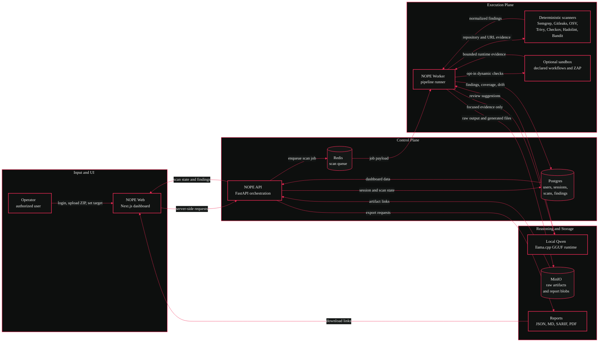

# NOPE<span style="color:#f02a56">.</span>


**NOPE is a local-first application security orchestration platform for evidence-driven scans.**

It accepts authorized repository ZIPs and URLs, runs deterministic scanner evidence first, normalizes findings, tracks untested areas, produces reports, and can optionally ask local Qwen through llama.cpp for focused reasoning over retrieved evidence.

NOPE does **not** claim that an application is fully secure, unhackable, compliant, or safe to ship. It shows what was checked, what failed, what was found, and what remains untested.

---

## What It Does

| Area | Capability |
| --- | --- |
| Authentication | Local users and sessions backed by Postgres |
| Ingestion | Repository ZIP uploads with archive safety checks |
| URL scope | Authorized URL scanning with private-network blocking by default |
| Queueing | Redis-backed scan jobs, retry metadata, and worker execution |
| Scanners | Semgrep, Gitleaks, OSV-Scanner, Trivy, Checkov, Hadolint, Bandit |
| Dynamic checks | Optional sandbox workflows and internal ZAP baseline scans via `.nope/sandbox.json` |
| Findings | Canonical findings, deduplication, lifecycle history, baselines, drift, coverage |
| Reports | JSON, Markdown, SARIF, and PDF exports |
| AI review | Optional local Qwen via llama.cpp CPU/GPU profiles |
| Storage | Postgres for structured data, MinIO for artifacts and report blobs |

Out of scope for this local build: email, SMTP, payments, subscriptions, production cloud deployment, and formal compliance certification.

---

## Data Flow Diagram



---

## Services

| Service | Container | Purpose |
| --- | --- | --- |
| Web | `NOPE` / `nope-web` | Landing page, login, dashboard |
| API | `nope-api` | Auth, orchestration, settings, reports, scan APIs |
| Worker | `nope-worker` | Redis consumer and scanner execution pipeline |
| Database | `nope-postgres` | Users, sessions, scans, findings, reports, settings |
| Queue | `nope-redis` | Scan queue, cancellation flags, worker heartbeat |
| Object storage | `nope-minio` | Raw scanner artifacts and binary report artifacts |
| AI runtime | `nope-ai` | Optional llama.cpp server for local Qwen |

---

## Requirements

- Docker Desktop with Docker Compose.
- Node.js 22+ or 24+ for local web development.
- pnpm 10+ for local web development.
- Python 3.11+ for local API tests.
- Optional NVIDIA container support for GPU Qwen.
- Optional GGUF model file, verified locally at:

```text
D:\Desktop\Model\Qwen3-8B-Q4_K_M.gguf
```

Do not commit the GGUF model, `.env`, scanner artifacts, local workspaces, MinIO data, or benchmark output.

---

## Local URLs

| Surface | URL |
| --- | --- |
| Web UI | `http://localhost:3000` |
| Login | `http://localhost:3000/login` |
| Dashboard | `http://localhost:3000/app/projects/local` |
| API | `http://localhost:8000` |
| API docs | `http://localhost:8000/docs` |
| MinIO console | `http://localhost:9001` |
| llama.cpp health/debug | `http://localhost:8081` |

Default MinIO development credentials:

```text
username: nope
password: nope-development-password
```

Except for `GET /health` and `POST /api/auth/login`, API routes require `Authorization: Bearer <token>`. The web dashboard forwards the HttpOnly local session cookie server-side.

---

## Docker Startup

### Core stack, no AI

```powershell
docker compose up --build -d
```

### Full GPU stack with local Qwen

```powershell
$env:NOPE_MODEL_HOST_DIR='D:\Desktop\Model'
$env:NOPE_MODEL_FILE='Qwen3-8B-Q4_K_M.gguf'
$env:NOPE_QWEN_GPU_LAYERS='28'
$env:NOPE_QWEN_GPU_MEMORY_TARGET_MB='5000'

docker compose -f docker-compose.yml -f docker-compose.ai-gpu.yml --profile ai-gpu up --build -d
```

### CPU fallback

```powershell
$env:NOPE_MODEL_HOST_DIR='D:\Desktop\Model'
$env:NOPE_MODEL_FILE='Qwen3-8B-Q4_K_M.gguf'

docker compose -f docker-compose.yml -f docker-compose.ai-cpu.yml --profile ai-cpu up --build -d
```

### Shutdown

```powershell
docker compose down
```

Use `docker compose down -v` only when you intentionally want to remove local Postgres, Redis, MinIO, and workspace volumes.

---

## Verified AI Settings

| Setting | Value |
| --- | --- |
| Runtime | llama.cpp |
| Host model path | `D:\Desktop\Model\Qwen3-8B-Q4_K_M.gguf` |
| Container model path | `/models/Qwen3-8B-Q4_K_M.gguf` |
| GPU layers | `28` |
| GPU memory target | `5000 MB` |

The verified local GPU setting is 28 layers under the 5 GB VRAM target. Thirty layers previously failed to fit, so 28 is the cap-safe setting for this development machine.

---

## Scanner Runtime

The Docker API image bundles the verified scanner toolchain:

- Semgrep
- Gitleaks
- OSV-Scanner
- Trivy
- Checkov
- Hadolint
- Bandit

OWASP ZAP baseline runs only through the sandbox dynamic path when a repository declares a safe internal target. Static repository scans mark ZAP as not applicable instead of fabricating results.

---

## Development Checks

Backend:

```powershell
$env:PYTHONPATH='apps/api'
python -m pytest apps/api/tests -q
python -m compileall apps/api/nope_api apps/api/tests apps/worker
```

Frontend:

```powershell
pnpm --dir apps/web lint
pnpm --dir apps/web typecheck
pnpm --dir apps/web test
pnpm --dir apps/web build
```

Docker and security:

```powershell
docker compose config --quiet
docker compose build nope-api nope-worker nope-web
docker compose run --rm --no-deps nope-api gitleaks detect --no-git --redact --source /app/apps/api/nope_api
```

---

## API Highlights

- `GET /health`
- `POST /api/auth/login`
- `GET /api/auth/me`
- `GET /api/projects`
- `GET /api/scans`
- `POST /api/scans/url`
- `POST /api/scans/repository`
- `POST /api/scans/full`
- `DELETE /api/scans/{scan_id}`
- `POST /api/scans/{scan_id}/cancel`
- `POST /api/scans/{scan_id}/retry`
- `GET /api/scans/{scan_id}/events`
- `GET /api/scans/{scan_id}/findings`
- `GET /api/scans/{scan_id}/findings/{finding_id}`
- `GET /api/scans/{scan_id}/report.{format}`
- `POST /api/scans/{scan_id}/baseline`
- `GET /api/scans/{scan_id}/compare`
- `GET /api/queue/status`
- `GET /api/worker/health`
- `GET /api/scanners/capabilities`
- `GET /api/settings/system`
- `GET /api/github/status`

See [`docs/API_REFERENCE.md`](docs/API_REFERENCE.md).

---

## Security Model

NOPE treats every uploaded repository and scanned target as potentially hostile.

- Scan only repositories and URLs you own or are explicitly authorized to test.
- ZIP uploads pass archive safety checks before extraction.
- Private-network URL targets are blocked by default.
- Qwen receives focused evidence only, not whole repositories.
- Qwen cannot override deterministic scanner evidence.
- Sandbox workflows are opt-in through `.nope/sandbox.json`.
- Sandbox containers do not receive NOPE service secrets, host home directories, or the Docker socket.
- GitHub private access remains blocked until real credentials are supplied and verified.

See [`docs/SECURITY_MODEL.md`](docs/SECURITY_MODEL.md).

---

## Limitations

- Local Docker is the verified deployment target.
- URL-only scans are non-destructive and do not prove runtime security.
- Scanner coverage gaps remain visible as untested or failed areas.
- Qwen is optional and may fail without blocking deterministic scans.
- Formal compliance certification is out of scope.
- Private GitHub repository access is intentionally blocked until credentials are configured.

---

## Documentation

| Document | Purpose |
| --- | --- |
| [`docs/ARCHITECTURE.md`](docs/ARCHITECTURE.md) | System structure and service boundaries |
| [`docs/PIPELINE.md`](docs/PIPELINE.md) | Scan lifecycle from input to reports |
| [`docs/SECURITY_MODEL.md`](docs/SECURITY_MODEL.md) | Threat model and local safety boundaries |
| [`docs/API_REFERENCE.md`](docs/API_REFERENCE.md) | API routes and contracts |
| [`docs/LOCAL_AI.md`](docs/LOCAL_AI.md) | Qwen and llama.cpp setup |
| [`docs/SCANNERS.md`](docs/SCANNERS.md) | Scanner behavior and evidence handling |
| [`docs/SANDBOX.md`](docs/SANDBOX.md) | Opt-in dynamic workflow execution |
| [`docs/TROUBLESHOOTING.md`](docs/TROUBLESHOOTING.md) | Common local Docker and runtime issues |
| [`docs/FEATURE_STATUS.md`](docs/FEATURE_STATUS.md) | Current implementation state |
