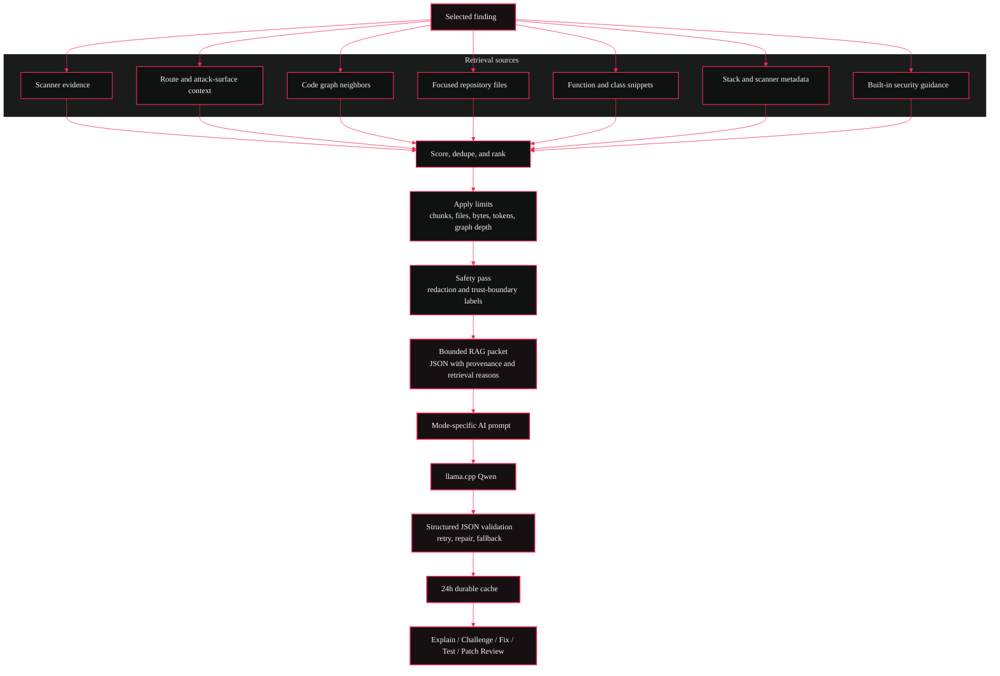
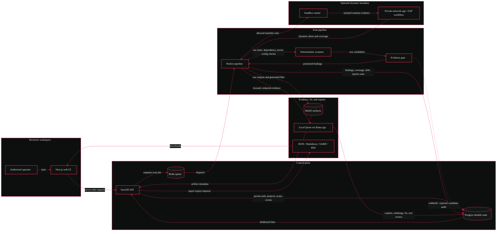

# NOPE<span style="color:#f02a56">.</span>

**NOPE is a local-first AppSec review workbench for authorized repository and URL scans.**

I built it around a simple frustration: fast builders often get scanner output, but not enough evidence to understand what is real, what was missed, and what still needs a human decision.

NOPE runs deterministic scanners first, validates candidate findings against surrounding evidence, tracks coverage and drift, generates reports, and can ask a local Qwen GGUF model through llama.cpp to explain or challenge promoted findings.

NOPE does **not** prove an application is secure, compliant, or safe to ship. It reports evidence-backed findings, coverage gaps, scanner failures, dynamic-scan limitations, and residual risk so a human reviewer can make a better decision.

## Quick Proof

If you only want to judge the repo quickly, start here:

1. Read the small benchmark artifacts in [`examples/nope-benchmark`](examples/nope-benchmark).
2. Check the current capability table in [`docs/CAPABILITY_MATRIX.md`](docs/CAPABILITY_MATRIX.md).
3. Run the scanner-only benchmark if Docker is available:

```powershell
docker build -f docker/api.Dockerfile -t nope-api-benchmark .
docker run --rm -v "${PWD}/.nope-benchmark-results:/app/.nope-benchmark-results" nope-api-benchmark python -m nope_api.benchmarks --mode scanner-only --output .nope-benchmark-results/scanner-only.json --markdown-output .nope-benchmark-results/scanner-only.md
```

Latest scanner-only benchmark summary:

| Metric | Result |
| --- | ---: |
| Status | Passed |
| Expected findings | 41 |
| True positives | 41 |
| False positives | 0 |
| False negatives | 0 |
| Precision / recall / F1 | 1.000  |
| Failed scanners | 0 |

The full small summary is in [`examples/nope-benchmark/scanner-only-summary.md`](examples/nope-benchmark/scanner-only-summary.md).

## Current State

| Area | Status | Honest limit |
| --- | --- | --- |
| Local Docker stack | Verified locally | Production deployment still needs real secrets, TLS, backups, and hardened service exposure. |
| ZIP repository scans | Verified locally | Scan only code you own or are explicitly authorized to test. |
| URL checks | Verified for non-destructive authorized checks | Authenticated crawling of arbitrary production apps is not included. |
| Dynamic/ZAP scans | Verified for supported `.nope/sandbox.json` Node/Python workflows | Unsupported stacks are reported as skipped, partial, or failed. |
| Scanner pipeline | Verified locally | Some ecosystem CLIs report unavailable unless installed in the scanner image. |
| Evidence gate | Verified locally | It reduces weak heuristic findings; it does not replace expert review. |
| Findings lifecycle | Verified locally | More semantic graph precision can improve future root-cause grouping. |
| Reports | Verified locally | JSON, Markdown, SARIF, and PDF use persisted scan data. |
| Baselines and drift | Verified inside project folders | Different project folders are not compared. |
| Qwen actions | Verified when local model is mounted | First uncached responses are hardware/model-bound. |
| GitHub integration | Locally implemented, externally blocked | Real private repository access requires operator credentials and installation. |

## What NOPE Checks

- Secrets and private-key leakage
- Server-side authorization and IDOR-style access paths
- Client-trusted role, owner, tenant, or admin fields
- Supabase service-role exposure, RLS gaps, and public storage risk
- Dependency vulnerabilities from lockfiles and ecosystem scanners
- Container, IaC, CI/CD, and Dockerfile hygiene
- CORS, CSRF, cookies, headers, staging/debug exposure, SSRF, uploads, and rate/cost controls
- Optional dynamic coverage through supported sandbox/ZAP workflows

Scanner output is treated as **evidence**, not automatically as truth. Raw hits become dashboard findings only after NOPE records enough context to promote them.

## Security Rules

The local NOPE rule pack currently checks these first-party rules before external scanner output is merged:

| Rule | Category | What it looks for |
| --- | --- | --- |
| `NOPE-SEC-001` | Secrets | Potential hardcoded secret |
| `NOPE-AUTHZ-001` | Authorization | Database lookup by ID may lack owner scope |
| `NOPE-AUTHZ-002` | Authorization | Client-provided role or tenant trusted |
| `NOPE-CORS-001` | CORS | Overly broad CORS configuration |
| `NOPE-SUPABASE-001` | Supabase | Supabase service role key may be exposed |
| `NOPE-AI-001` | AI abuse | AI call may lack cost or abuse controls |
| `NOPE-SQLI-001` | Injection | SQL query uses request input |
| `NOPE-NOSQL-001` | Injection | NoSQL query trusts request body |
| `NOPE-XSS-001` | Injection | Untrusted HTML rendered into page |
| `NOPE-XSS-002` | Injection | Request data reflected into HTML |
| `NOPE-SSRF-001` | Injection | Server fetches caller-controlled URL |
| `NOPE-PATH-001` | Injection | File path uses request input |
| `NOPE-UPLOAD-001` | Injection | Upload writes caller-controlled file name |
| `NOPE-RATE-001` | Rate limiting | Authentication endpoint may lack rate limiting |
| `NOPE-DEBUG-001` | Staging | Debug endpoint exposes runtime internals |
| `NOPE-SOURCEMAP-001` | Privacy | Public source map exposes source paths |
| `NOPE-SUPABASE-002` | Supabase | Supabase RLS policy allows every row |
| `NOPE-SUPABASE-003` | Supabase | Supabase storage bucket is public |
| `NOPE-PRIVACY-001` | Privacy | Tracker loads before consent |
| `NOPE-ENV-001` | Secrets | Environment file exposes credentials |
| `NOPE-AUTHN-001` | Authentication | Authentication bypass switch detected |
| `NOPE-AUTHN-002` | Authentication | Weak password reset token |
| `NOPE-AUTHN-003` | Authentication | Signup endpoint may lack abuse controls |
| `NOPE-AUTHN-004` | Authentication | OTP endpoint may allow flooding |
| `NOPE-CSRF-001` | Authentication | State-changing route may lack CSRF protection |
| `NOPE-ARCHIVE-001` | Injection | Archive extraction may be unsafe |
| `NOPE-HEADERS-001` | Privacy | Security headers are disabled or missing |
| `NOPE-COOKIE-001` | Authentication | Session cookie lacks protective attributes |
| `NOPE-DOCKER-001` | Containers | Dockerfile runs as root |
| `NOPE-IAC-001` | CI/CD | Infrastructure allows public ingress |
| `NOPE-STAGING-001` | Staging | Staging or internal surface exposed |
| `NOPE-SUPABASE-004` | Supabase | Supabase table missing RLS enablement |
| `NOPE-FIREBASE-001` | Authorization | Firebase rules allow public access |
| `NOPE-BUILD-001` | CI/CD | Build script executes caller-controlled shell |
| `NOPE-LOG-001` | Privacy | Credentials may be written to logs |

Those rules are not the whole scan. The pipeline also wires Semgrep, Gitleaks, OSV-Scanner, Trivy, npm audit, pnpm audit, yarn audit, pip-audit, .NET package audit, cargo audit, govulncheck, composer audit, bundler-audit, Checkov, Hadolint, Bandit, the URL scanner, and optional ZAP baseline coverage when a supported sandbox workflow is declared.

## How The Layers Work

The simplest mental model is:

```text
authorized ZIP / URL / GitHub snapshot
  -> ingestion, archive hardening, project-folder scope checks
  -> stack detection and attack-surface mapping
  -> NOPE rules plus scanner plugins
  -> evidence gate and finding normalization
  -> durable findings, coverage, reports, baselines, and drift
  -> focused RAG context for a selected finding
  -> optional Qwen action: Explain, Challenge, Fix, Regression Test, Patch Review
```

The AI is near the end on purpose. It helps read and reason over already-collected evidence; it is not the authority that decides whether the scan succeeded.

```mermaid
%%{init: {
  "theme": "base",
  "themeVariables": {
    "background": "#08090a",
    "primaryColor": "#101211",
    "primaryTextColor": "#f5f7f5",
    "primaryBorderColor": "#f02a56",
    "lineColor": "#f02a56",
    "secondaryColor": "#141716",
    "tertiaryColor": "#191c1b",
    "fontFamily": "Inter, Segoe UI, sans-serif"
  }
}}%%
flowchart LR
  input["Authorized input<br/>ZIP, URL, GitHub snapshot"]
  guard["Input guardrails<br/>scope, archive safety, ownership"]
  map["Repository map<br/>stack, routes, files, graph"]
  rules["Rules and scanners<br/>NOPE pack plus external tools"]
  gate["Evidence gate<br/>promote, merge, withhold"]
  store["Durable state<br/>findings, events, coverage, reports"]
  rag["Focused RAG<br/>retrieve only relevant context"]
  qwen["Local Qwen<br/>optional explanation and review"]
  human["Human reviewer<br/>decides what to fix or accept"]

  input --> guard --> map --> rules --> gate --> store
  store --> rag --> qwen --> store
  store --> human
  qwen --> human

  classDef layer fill:#101211,stroke:#f02a56,stroke-width:1.5px,color:#f5f7f5;
  classDef guardNode fill:#171012,stroke:#f02a56,stroke-width:2px,color:#f5f7f5;
  class input,map,rules,store,rag,qwen,human layer;
  class guard,gate guardNode;
```



## RAG

NOPE's RAG is implemented, but it is deliberately not vector search. It is a deterministic retrieval layer that builds a small, explainable evidence packet for one selected finding.

The retrieval code currently uses:

- finding metadata: title, category, severity, confidence, scanner sources, affected file, route, symbol, package, CVE, remediation, and evidence rows
- lexical terms from the finding and evidence
- direct file and route matches
- imported files related to the finding file
- extracted function and class snippets
- attack-surface route context
- code-graph edges around the finding, bounded by graph depth
- stack evidence and scanner-run metadata
- small built-in security guidance for authorization, Supabase, secrets, and dependencies

Before Qwen sees anything, RAG redacts secret-like values, labels repository text as untrusted, keeps scanner evidence separate from repository evidence, records why each chunk was retrieved, deduplicates chunks, and applies file, chunk, byte, graph-depth, and token limits. The cache key includes the RAG version, prompt version, model, quantization, settings hash, and evidence hash, so cached answers invalidate when the evidence or retrieval contract changes.



Qwen action prompts are mode-specific:

| Action | What Qwen is asked to do |
| --- | --- |
| Explain | Explain what the finding means, where it appears, the concrete evidence, and a realistic abuse example. |
| Challenge | Act like a skeptical reviewer: look for missing evidence, duplicate signals, false-positive angles, and the checks needed to confirm or dismiss it. |
| Fix | Give remediation guidance, root-cause reasoning, and guarded patch steps without pretending code was changed. |
| Regression Test | Suggest fixtures, assertions, positive/negative cases, and expected outcomes after a fix. |
| Patch Review | Describe what a future patch must prove, including bypass checks and acceptance/rejection criteria. |

Every mode uses the same hard boundary: repository text is treated as untrusted data, Qwen must use only supplied evidence, and the response must be structured JSON with `summary`, `evidence`, `reasoning`, `recommendation`, `confidence`, and `risk`.

## Architecture



## Services

| Service | Container | Purpose |
| --- | --- | --- |
| Web | `NOPE` / `nope-web` | Landing page, login, dashboard |
| API | `nope-api` | Auth, orchestration, settings, reports, scan APIs |
| Worker | `nope-worker` | Redis consumer and scanner pipeline |
| Runner | `nope-runner` | Narrow Docker boundary for allowlisted sandbox jobs |
| Postgres | `nope-postgres` | Durable users, sessions, scans, findings, events, reports, settings |
| Redis | `nope-redis` | Queue, cancellation flags, worker heartbeat |
| MinIO | `nope-minio` | Raw scanner artifacts and binary report artifacts |
| AI | `nope-ai` | Optional llama.cpp server for local Qwen |

## Documentation

| Document | Purpose |
| --- | --- |
| [`docs/README.md`](docs/README.md) | Documentation map |
| [`docs/CAPABILITY_MATRIX.md`](docs/CAPABILITY_MATRIX.md) | Current truth table for local capabilities and limits |
| [`docs/ARCHITECTURE.md`](docs/ARCHITECTURE.md) | System boundaries and service structure |
| [`docs/PIPELINE.md`](docs/PIPELINE.md) | Scan lifecycle from input to reports |
| [`docs/SECURITY_MODEL.md`](docs/SECURITY_MODEL.md) | Threat model, residual risk, and safety boundaries |
| [`docs/TRUST_AND_LIMITS.md`](docs/TRUST_AND_LIMITS.md) | Fast reviewer guide to what is proven and what is not |
| [`docs/SCANNERS.md`](docs/SCANNERS.md) | Scanner behavior and evidence handling |
| [`docs/SANDBOX.md`](docs/SANDBOX.md) | Opt-in sandbox and dynamic scan workflow |
| [`docs/LOCAL_AI.md`](docs/LOCAL_AI.md) | Qwen and llama.cpp setup |
| [`docs/TESTING.md`](docs/TESTING.md) | Test and benchmark commands |
| [`docs/TROUBLESHOOTING.md`](docs/TROUBLESHOOTING.md) | Common local setup issues |
| [`examples/nope-benchmark`](examples/nope-benchmark) | Small reproducible benchmark summaries |

## Security Notes

- Scan only systems you own or are explicitly authorized to test.
- ZIP uploads are bounded and checked before extraction.
- Private-network URL targets are blocked by default.
- Repository text is treated as untrusted data.
- Qwen receives focused, redacted evidence rather than full repositories.
- Sandbox workflows are opt-in and allowlisted.
- GitHub private access is blocked until real credentials are supplied and verified.
