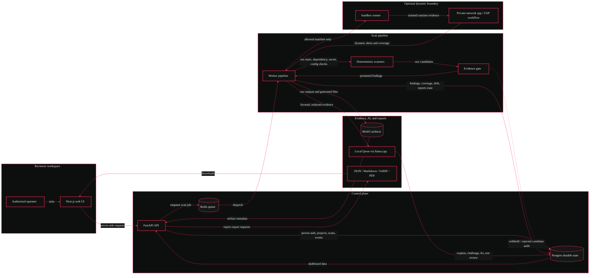

# NOPE<span style="color:#f02a56">.</span>

**NOPE is a local-first AppSec review workbench for authorized repository and URL scans.**

I built it around a simple frustration: fast builders often get scanner output, but not enough evidence to understand what is real, what was missed, and what still needs a human decision.

NOPE runs deterministic scanners first, validates candidate findings against surrounding evidence, tracks coverage and drift, generates reports, and can ask a local Qwen GGUF model through llama.cpp to explain or challenge promoted findings.

NOPE does **not** prove an application is secure, compliant, or safe to ship. It reports evidence-backed findings, coverage gaps, scanner failures, dynamic-scan limitations, and residual risk so a human reviewer can make a better decision.

## Quick Proof

If you only want to judge the repo quickly, start here:

1. Read the small benchmark artifacts in [`examples/nope-benchmark`](examples/nope-benchmark).
2. Check the current capability table in [`docs/CAPABILITY_MATRIX.md`](docs/CAPABILITY_MATRIX.md).
3. Run the scanner-only benchmark if Docker is available:

```powershell
docker build -f docker/api.Dockerfile -t nope-api-benchmark .
docker run --rm -v "${PWD}/.nope-benchmark-results:/app/.nope-benchmark-results" nope-api-benchmark python -m nope_api.benchmarks --mode scanner-only --output .nope-benchmark-results/scanner-only.json --markdown-output .nope-benchmark-results/scanner-only.md
```

## Current State

| Area | Status | Honest limit |
| --- | --- | --- |
| Local Docker stack | Verified locally | Production deployment still needs real secrets, TLS, backups, and hardened service exposure. |
| ZIP repository scans | Verified locally | Scan only code you own or are explicitly authorized to test. |
| URL checks | Verified for non-destructive authorized checks | Authenticated crawling of arbitrary production apps is not included. |
| Dynamic/ZAP scans | Verified for supported `.nope/sandbox.json` Node/Python workflows | Unsupported stacks are reported as skipped, partial, or failed. |
| Scanner pipeline | Verified locally | Some ecosystem CLIs report unavailable unless installed in the scanner image. |
| Evidence gate | Verified locally | It reduces weak heuristic findings; it does not replace expert review. |
| Findings lifecycle | Verified locally | More semantic graph precision can improve future root-cause grouping. |
| Reports | Verified locally | JSON, Markdown, SARIF, and PDF use persisted scan data. |
| Baselines and drift | Verified inside project folders | Different project folders are not compared. |
| Qwen actions | Verified when local model is mounted | First uncached responses are hardware/model-bound. |
| GitHub integration | Locally implemented, externally blocked | Real private repository access requires operator credentials and installation. |

## What NOPE Checks

- Secrets and private-key leakage
- Server-side authorization and IDOR-style access paths
- Client-trusted role, owner, tenant, or admin fields
- Supabase service-role exposure, RLS gaps, and public storage risk
- Dependency vulnerabilities from lockfiles and ecosystem scanners
- Container, IaC, CI/CD, and Dockerfile hygiene
- CORS, CSRF, cookies, headers, staging/debug exposure, SSRF, uploads, and rate/cost controls
- Optional dynamic coverage through supported sandbox/ZAP workflows

Scanner output is treated as **evidence**, not automatically as truth. Raw hits become dashboard findings only after NOPE records enough context to promote them.

## Architecture



## Services

| Service | Container | Purpose |
| --- | --- | --- |
| Web | `NOPE` / `nope-web` | Landing page, login, dashboard |
| API | `nope-api` | Auth, orchestration, settings, reports, scan APIs |
| Worker | `nope-worker` | Redis consumer and scanner pipeline |
| Runner | `nope-runner` | Narrow Docker boundary for allowlisted sandbox jobs |
| Postgres | `nope-postgres` | Durable users, sessions, scans, findings, events, reports, settings |
| Redis | `nope-redis` | Queue, cancellation flags, worker heartbeat |
| MinIO | `nope-minio` | Raw scanner artifacts and binary report artifacts |
| AI | `nope-ai` | Optional llama.cpp server for local Qwen |

## Run Locally

Core stack:

```powershell
docker compose up --build -d
```

Full GPU stack with local Qwen:

```powershell
$env:NOPE_MODEL_HOST_DIR='D:\Desktop\Model'
$env:NOPE_MODEL_FILE='Qwen3-8B-Q4_K_M.gguf'
$env:NOPE_QWEN_GPU_LAYERS='28'
$env:NOPE_QWEN_GPU_MEMORY_TARGET_MB='5000'

docker compose -f docker-compose.yml -f docker-compose.ai-gpu.yml --profile ai-gpu up --build -d
```

CPU fallback:

```powershell
$env:NOPE_MODEL_HOST_DIR='D:\Desktop\Model'
$env:NOPE_MODEL_FILE='Qwen3-8B-Q4_K_M.gguf'

docker compose -f docker-compose.yml -f docker-compose.ai-cpu.yml --profile ai-cpu up --build -d
```

Local URLs:

| Surface | URL |
| --- | --- |
| Web UI | `http://localhost:3000` |
| API docs | `http://localhost:8000/docs` |
| MinIO console | `http://localhost:9001` |
| llama.cpp health/debug | `http://localhost:8081` |

Default MinIO development credentials:

```text
username: nope
password: nope-development-password
```

## Development Checks

Backend:

```powershell
python -m pytest apps/api/tests -q
python -m compileall apps/api/nope_api apps/api/tests apps/worker
```

Frontend:

```powershell
pnpm --dir apps/web lint
pnpm --dir apps/web typecheck
pnpm --dir apps/web build
pnpm --dir apps/web test:e2e
```

Benchmarks:

```powershell
docker build -f docker/api.Dockerfile -t nope-api-benchmark .
docker run --rm -v "${PWD}/.nope-benchmark-results:/app/.nope-benchmark-results" nope-api-benchmark python -m nope_api.benchmarks --mode scanner-only --output .nope-benchmark-results/scanner-only.json --markdown-output .nope-benchmark-results/scanner-only.md
```

GitHub currently runs:

- scanner-only benchmark
- browser E2E, accessibility, and visual regression

## Local AI

The verified development setup uses:

| Setting | Value |
| --- | --- |
| Runtime | llama.cpp |
| Model | `Qwen3-8B-Q4_K_M.gguf` |
| Host model directory | `D:\Desktop\Model` |
| Container model path | `/models/Qwen3-8B-Q4_K_M.gguf` |
| GPU layers | `28` |
| VRAM target | `<= 5000 MB` |

Qwen actions are optional and durable. If AI fails, deterministic scan results are preserved.

## Project Layout

```text
apps/
  api/       FastAPI API, scan engine, scanners, persistence, tests
  web/       Next.js dashboard, E2E tests, visual snapshots
  worker/    Redis worker entrypoint
benchmarks/  Versioned scanner benchmark fixture and expected output
docker/      API and web Dockerfiles
docs/        Current project documentation
docs/audits/ Older build/audit notes kept for archaeology
examples/    Small benchmark summaries for quick review
packages/    Shared TypeScript types
security-packs/
  semgrep/   Local Semgrep rules
```

## Documentation

| Document | Purpose |
| --- | --- |
| [`docs/README.md`](docs/README.md) | Documentation map |
| [`docs/CAPABILITY_MATRIX.md`](docs/CAPABILITY_MATRIX.md) | Current truth table for local capabilities and limits |
| [`docs/ARCHITECTURE.md`](docs/ARCHITECTURE.md) | System boundaries and service structure |
| [`docs/PIPELINE.md`](docs/PIPELINE.md) | Scan lifecycle from input to reports |
| [`docs/SECURITY_MODEL.md`](docs/SECURITY_MODEL.md) | Threat model, residual risk, and safety boundaries |
| [`docs/TRUST_AND_LIMITS.md`](docs/TRUST_AND_LIMITS.md) | Fast reviewer guide to what is proven and what is not |
| [`docs/SCANNERS.md`](docs/SCANNERS.md) | Scanner behavior and evidence handling |
| [`docs/SANDBOX.md`](docs/SANDBOX.md) | Opt-in sandbox and dynamic scan workflow |
| [`docs/LOCAL_AI.md`](docs/LOCAL_AI.md) | Qwen and llama.cpp setup |
| [`docs/TESTING.md`](docs/TESTING.md) | Test and benchmark commands |
| [`docs/TROUBLESHOOTING.md`](docs/TROUBLESHOOTING.md) | Common local setup issues |
| [`examples/nope-benchmark`](examples/nope-benchmark) | Small reproducible benchmark summaries |

## Security Notes

- Scan only systems you own or are explicitly authorized to test.
- ZIP uploads are bounded and checked before extraction.
- Private-network URL targets are blocked by default.
- Repository text is treated as untrusted data.
- Qwen receives focused, redacted evidence rather than full repositories.
- Sandbox workflows are opt-in and allowlisted.
- GitHub private access is blocked until real credentials are supplied and verified.
