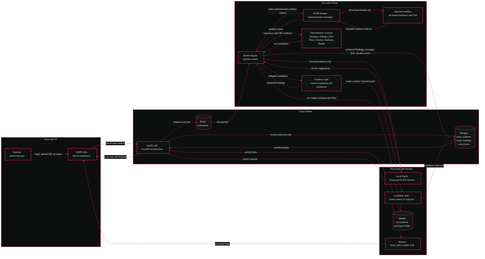

# NOPE<span style="color:#f02a56">.</span>


**NOPE is a local-first application security scanning dashboard for evidence-driven reviews.**

It accepts authorized repository ZIPs and URLs, runs deterministic scanner evidence first, tracks what was and was not tested, produces reports, and can optionally ask local Qwen through llama.cpp to reason over focused evidence.

NOPE does **not** claim an app is fully secure, compliant, or safe to ship. It shows findings, evidence, coverage gaps, scanner failures, and untested areas.

---

## Quick Q/A

### What does the pipeline do?

The pipeline is the main scan engine.

It:

- validates ZIPs, URLs, project folders, and authorization scope
- extracts repository ZIPs safely
- queues work in Redis
- runs the worker pipeline
- detects stack/frameworks
- builds attack surface and code graph evidence
- runs NOPE rules and bundled scanners
- optionally runs sandbox workflows
- normalizes and deduplicates raw candidate findings
- expands source context around each candidate
- promotes only evidence-backed findings into the Findings view
- keeps weak, generated, contradicted, or under-context candidates out of scoring
- calculates coverage, score, and verdict
- records ordered durable progress events for browser/API/worker restarts
- persists scans, findings, stages, scanner runs, reports, baselines, and drift data

In short: **the pipeline does the security scanning work.**

### When does a scanner hit become a finding?

A scanner hit starts as a **candidate**, not a dashboard finding.

Before promotion, NOPE now runs an evidence gate that checks:

- whether the affected file is source code, generated output, dependency output, or a build artifact
- whether the matched snippet actually supports the rule category
- nearby source context around the matched line
- rule-specific signals, such as data access plus caller-controlled IDs for IDOR checks
- contradiction signals, such as nearby owner, tenant, authenticated-user, policy, or RLS scope
- structured scanner identity, such as package plus CVE for dependency findings

Promoted findings are used for the Findings page, score, verdict, reports, baselines, drift, and Qwen review. Weak candidates remain recorded in the scan stage audit as `needs_context` or `rejected`, but they do not count as real findings.

In short: **raw scanner output is evidence; Findings are promoted evidence.**

### How does NOPE avoid inconclusive findings?

NOPE rejects or withholds findings when the local evidence does not prove the claim well enough.

For example, an authorization rule hit inside `.svelte-kit/output/server/chunks/server.js` is no longer promoted just because a generated bundle contains suspicious text. For an IDOR-style finding to be promoted, NOPE expects source-route or server-file context, a data-access sink, a caller-controlled identifier, and no nearby owner or tenant scope.

Secrets and dependency CVEs are handled differently: generated bundles can still expose real secrets, and dependency findings are anchored by package/CVE identity.

In short: **the pipeline is stricter where heuristics used to be noisy, without hiding high-signal evidence.**

### What is the finding lifecycle?

NOPE stores every promoted finding with a canonical fingerprint, original scanner fingerprint, scanner/source metadata, evidence rows, status, recurrence count, suppression metadata, and lifecycle version.

Supported lifecycle states are `new`, `confirmed`, `fixing`, `fixed`, `verified`, `false_positive`, `accepted_risk`, `suppressed`, `reopened`, and `reintroduced`.

Lifecycle updates are owner-scoped, version-checked, and audited. Suppressions require a reason, actor, timestamp, scope, and optional expiry. Expired suppressions reopen automatically. When a previously fixed or verified canonical fingerprint appears again in a later scan for the same project folder, NOPE marks it as reintroduced.

### What does RAG do?

RAG does **not** scan the app by itself.

RAG retrieves focused context for Qwen after the pipeline has promoted findings and evidence. It gathers:

- the selected finding
- scanner evidence
- source snippets near affected files
- route and attack-surface context
- code graph edges
- evidence-gate promotion reasons
- stack evidence
- scanner run metadata
- category-specific security guidance

RAG redacts secrets, marks repository text as untrusted data, removes duplicate chunks, and enforces file/chunk/token limits. It does not currently use embeddings or vector search; it uses deterministic metadata, keyword, route, file, import, and graph scoring.

In short: **RAG prepares focused evidence for AI.**

### What does the AI do?

AI is optional. When enabled, local Qwen runs through the `nope-ai` llama.cpp container.

Qwen can:

- explain a finding
- challenge whether a finding is well-supported
- suggest a fix direction
- suggest regression/security tests
- add an AI review message after a scan

Qwen cannot:

- replace deterministic scanners
- silently downgrade findings
- promote weak candidates into findings
- prove the app is secure
- run the scan by itself
- receive the whole repository as raw context

If Qwen fails, deterministic scan results are preserved.

In short: **AI is the reviewer/explainer layer, not the scanner engine.**

### How do folders work?

Folders are project workspaces. Each folder owns its own ZIP uploads, scan history, findings, reports, baselines, and drift comparisons.

When you switch the active folder in the sidebar, dashboard pages use that folder by default:

- Overview
- Findings
- Attack Map
- Coverage
- Assets
- Reports
- Scans

Different folders do not mix findings or scan history.

### How does drift work?

Drift compares scans inside the same folder/project. It can compare:

- latest scan vs previous matching scan
- scan vs baseline
- explicit scan vs scan

Different project folders are not compared. ZIP scaffold similarity is checked before accepting a new upload into an existing folder; low-similarity ZIPs require an explicit override.

### What does NOPE check?

NOPE combines custom rules, local Semgrep rules, external scanner adapters, URL checks, and optional sandbox checks.

Custom NOPE rules currently check for:

- hardcoded credentials and private keys
- database lookups by ID that may lack owner/tenant scope
- client-provided role, owner, tenant, or admin fields being trusted
- wildcard CORS configuration
- exposed Supabase service-role or server-only keys
- AI calls without nearby rate, token, timeout, or budget controls

Local Semgrep rules currently check for:

- hardcoded secret-like assignments
- wildcard CORS header patterns

Bundled scanner adapters:

| Scanner | Main coverage |
| --- | --- |
| Semgrep | Injection, authorization, authentication, secrets |
| Gitleaks | Secrets |
| OSV-Scanner | Vulnerable dependencies |
| Trivy | Dependencies, containers, CI/CD, secrets, misconfigurations |
| npm audit | Node dependencies from `package-lock.json` |
| pnpm audit | Node dependencies from `pnpm-lock.yaml` |
| yarn audit | Node dependencies from `yarn.lock` |
| pip-audit | Python dependencies from requirements/project manifests |
| .NET package audit | NuGet vulnerable package output when .NET SDK is installed |
| cargo audit | Rust dependencies from `Cargo.lock` when cargo-audit is installed |
| govulncheck | Go reachable vulnerabilities from `go.mod` when govulncheck is installed |
| composer audit | PHP dependencies from `composer.lock` when Composer is installed |
| bundler-audit | Ruby gems from `Gemfile.lock` when bundler-audit is installed |
| Checkov | Infrastructure, CI/CD, containers |
| Hadolint | Dockerfile/container hygiene |
| Bandit | Python injection and secret patterns |
| NOPE URL scanner | Security headers, staging exposure, URL scope, privacy hints |
| NOPE sandbox / ZAP | Optional dynamic testing when `.nope/sandbox.json` declares safe workflows |

Scanner failures are not hidden. They are recorded as failed or not-applicable coverage.

Ecosystem scanner plugins prefer lockfiles and machine-readable output. They never run package scripts, installers, or arbitrary repository commands. If a project is applicable but the required CLI is not installed in the scanner image, NOPE records the scanner as unavailable/failed coverage instead of pretending it ran.

Raw candidate findings that fail evidence validation are also not hidden. The scan stage audit records how many candidates were promoted, withheld for more context, or rejected before the dashboard Findings view was populated.

### How does dynamic scanning work?

Stage 4 supports four scan modes:

- static repository scans
- authorized URL scans
- repository build-and-run dynamic scans
- combined repository-plus-URL scans

Repository dynamic scanning is opt-in through `.nope/sandbox.json`. For supported manifests, NOPE runs allowlisted Node or Python build/start commands, waits for readiness, creates a private Docker network, runs OWASP ZAP baseline against only the internal app container, captures the ZAP version/config/raw JSON report, parses alerts into normal findings, and tears everything down.

Supported initial app starts are `node server.js`, `python app.py`, and `python -m http.server 8080 --bind 0.0.0.0`. External URL scans remain non-destructive and scope-checked; ZAP is not pointed at arbitrary public hosts.

In short: **dynamic testing is real when a repository declares a safe supported runtime, and skipped/partial/failed states are reported honestly.**

---

## Data Flow Diagram



---

## Services

| Service | Container | Purpose |
| --- | --- | --- |
| Web | `NOPE` / `nope-web` | Landing page, login, dashboard |
| API | `nope-api` | Auth, orchestration, settings, reports, scan APIs |
| Worker | `nope-worker` | Redis consumer and scanner execution pipeline |
| Runner | `nope-runner` | Narrow internal Docker boundary for allowlisted sandbox jobs |
| Database | `nope-postgres` | Users, sessions, scans, findings, reports, settings |
| Queue | `nope-redis` | Scan queue, cancellation flags, worker heartbeat |
| Object storage | `nope-minio` | Raw scanner artifacts and binary report artifacts |
| AI runtime | `nope-ai` | Optional llama.cpp server for local Qwen |

---

## Local URLs

| Surface | URL |
| --- | --- |
| Web UI | `http://localhost:3000` |
| Login | `http://localhost:3000/login` |
| Dashboard | `http://localhost:3000/app/projects/local` |
| API | `http://localhost:8000` |
| API docs | `http://localhost:8000/docs` |
| MinIO console | `http://localhost:9001` |
| llama.cpp health/debug | `http://localhost:8081` |

Default MinIO development credentials:

```text
username: nope
password: nope-development-password
```

---

## Run Locally

### Core stack, no AI

```powershell
docker compose up --build -d
```

### Full GPU stack with local Qwen

```powershell
$env:NOPE_MODEL_HOST_DIR='D:\Desktop\Model'
$env:NOPE_MODEL_FILE='Qwen3-8B-Q4_K_M.gguf'
$env:NOPE_QWEN_GPU_LAYERS='28'
$env:NOPE_QWEN_GPU_MEMORY_TARGET_MB='5000'

docker compose -f docker-compose.yml -f docker-compose.ai-gpu.yml --profile ai-gpu up --build -d
```

### CPU fallback

```powershell
$env:NOPE_MODEL_HOST_DIR='D:\Desktop\Model'
$env:NOPE_MODEL_FILE='Qwen3-8B-Q4_K_M.gguf'

docker compose -f docker-compose.yml -f docker-compose.ai-cpu.yml --profile ai-cpu up --build -d
```

### Shutdown

```powershell
docker compose down
```

Use `docker compose down -v` only when you intentionally want to remove local Postgres, Redis, MinIO, and workspace volumes.

---

## Verified Local AI Settings

| Setting | Value |
| --- | --- |
| Runtime | llama.cpp |
| Host model path | `D:\Desktop\Model\Qwen3-8B-Q4_K_M.gguf` |
| Container model path | `/models/Qwen3-8B-Q4_K_M.gguf` |
| GPU layers | `28` |
| GPU memory target | `5000 MB` |

The verified local GPU setting is 28 layers under the 5 GB VRAM target. Thirty layers previously failed to fit on the development machine.

---

## Development Checks

Backend:

```powershell
$env:PYTHONPATH='apps/api'
python -m pytest apps/api/tests -q
python -m compileall apps/api/nope_api apps/api/tests apps/worker
```

Frontend:

```powershell
pnpm --dir apps/web lint
pnpm --dir apps/web typecheck
pnpm --dir apps/web build
```

Docker:

```powershell
docker compose config --quiet
docker compose build nope-api nope-worker nope-web
```

---

## Security Notes

- Scan only repositories and URLs you own or are explicitly authorized to test.
- ZIP uploads pass archive safety checks before extraction.
- Private-network URL targets are blocked by default.
- Qwen receives focused evidence only, not whole repositories.
- Repository text is treated as untrusted data in RAG prompts.
- Sandbox workflows are opt-in through `.nope/sandbox.json`.
- Sandbox containers do not receive NOPE service secrets, host home directories, or the Docker socket.
- GitHub private access remains blocked until real credentials are supplied and verified.

---

## Docs

| Document | Purpose |
| --- | --- |
| [`docs/ARCHITECTURE.md`](docs/ARCHITECTURE.md) | System structure and service boundaries |
| [`docs/PIPELINE.md`](docs/PIPELINE.md) | Scan lifecycle from input to reports |
| [`docs/SECURITY_MODEL.md`](docs/SECURITY_MODEL.md) | Threat model and local safety boundaries |
| [`docs/API_REFERENCE.md`](docs/API_REFERENCE.md) | API routes and contracts |
| [`docs/LOCAL_AI.md`](docs/LOCAL_AI.md) | Qwen and llama.cpp setup |
| [`docs/SCANNERS.md`](docs/SCANNERS.md) | Scanner behavior and evidence handling |
| [`docs/SANDBOX.md`](docs/SANDBOX.md) | Opt-in dynamic workflow execution |
| [`docs/TROUBLESHOOTING.md`](docs/TROUBLESHOOTING.md) | Common local Docker and runtime issues |
